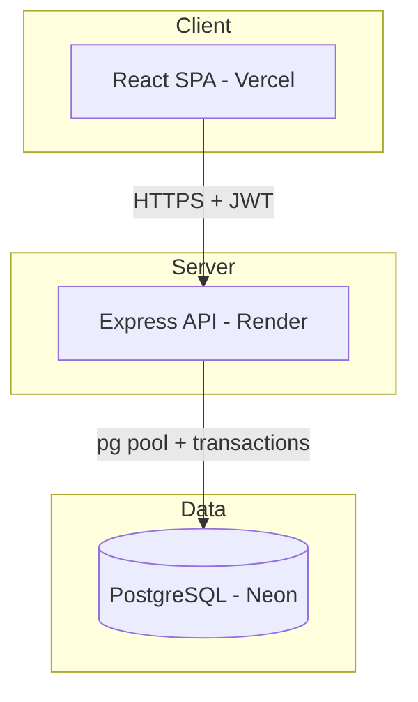
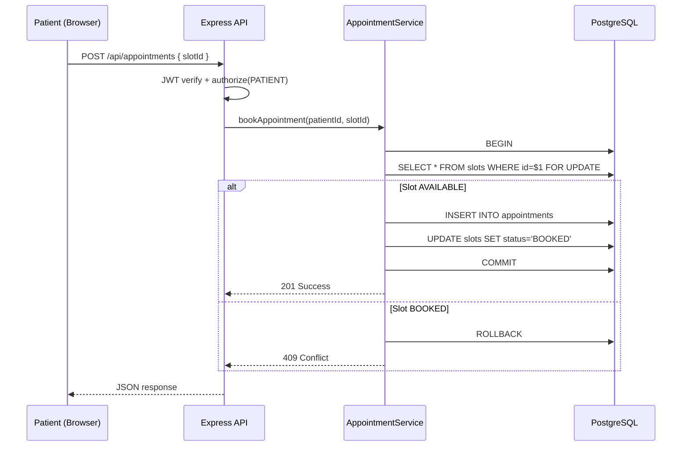

# Architecture

## System Overview

## Request Flow — Booking an Appointment

## Layered Architecture

| Layer        | Responsibility                          |
|--------------|-----------------------------------------|
| Routes       | HTTP routing, middleware chain          |
| Controllers  | Parse request, call service, send response |
| Services     | Business logic, SQL queries, transactions |
| Middleware   | Auth, validation, error handling        |
| Database     | Connection pool, schema, migrations     |

## Security

- Passwords hashed with bcrypt (salt rounds: 10)
- JWT for stateless authentication
- Parameterized SQL queries throughout (SQL injection prevention)
- Role-based authorization on sensitive endpoints
- CORS enabled for frontend origin
