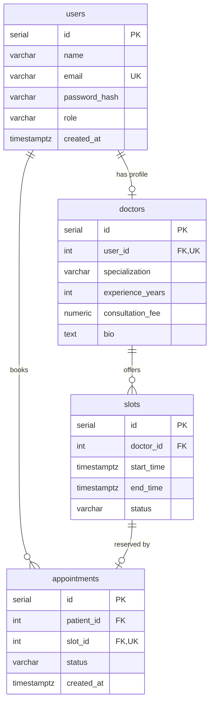

# Database ER Diagram



## Indexes

| Table         | Index              | Purpose                    |
|---------------|--------------------|----------------------------|
| slots         | doctor_id          | Filter slots by doctor     |
| slots         | start_time         | Sort/filter by time        |
| appointments  | patient_id         | Patient appointment lookup |
| appointments  | status             | Filter by status           |

## Constraints

| Constraint                    | Type    | Purpose                              |
|-------------------------------|---------|--------------------------------------|
| users.email                   | UNIQUE  | One account per email                |
| doctors.user_id               | UNIQUE  | One doctor profile per user          |
| appointments.slot_id          | UNIQUE  | One appointment per slot             |
| no_overlapping_slots          | EXCLUDE | Prevent overlapping doctor slots     |
| slots.end_time > start_time   | CHECK   | Valid time range                     |

## Overlap Prevention (Database Level)

```sql
CONSTRAINT no_overlapping_slots EXCLUDE USING gist (
  doctor_id WITH =,
  tstzrange(start_time, end_time, '[)') WITH &&
)
```

This rejects any INSERT that would create overlapping time ranges for the same doctor.
